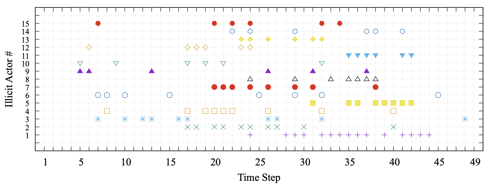
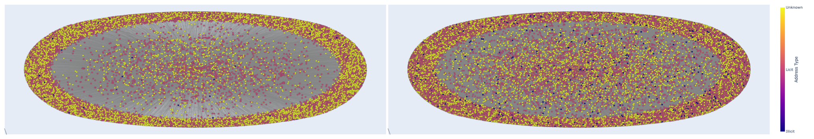
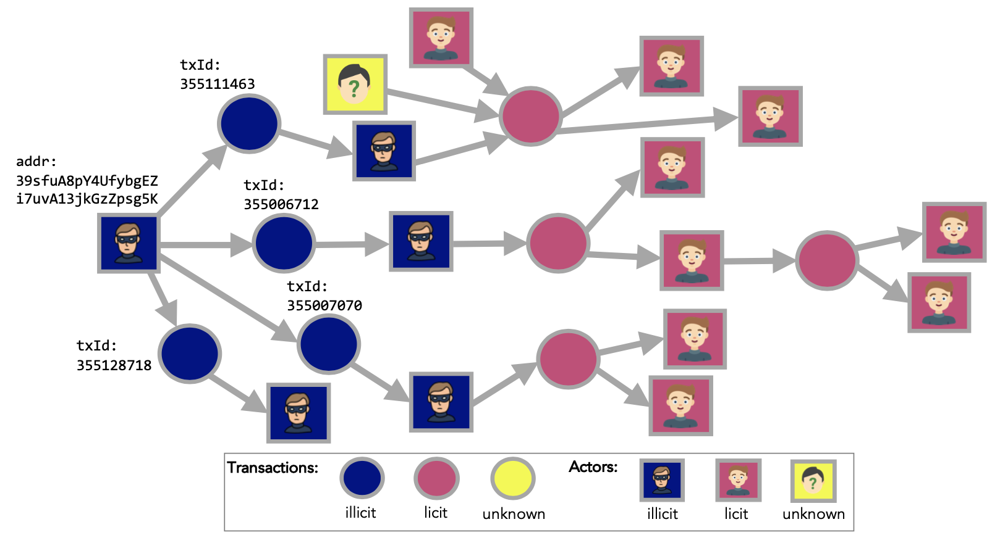
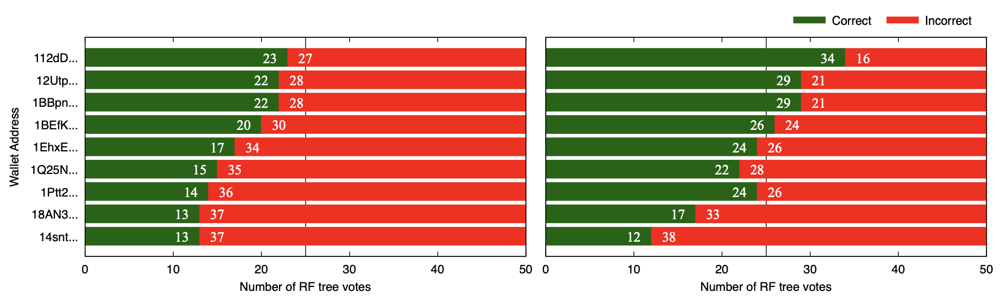

# Elliptic++ Actors (Wallet Addresses) Dataset: A Graph Network of Bitcoin Blockchain Wallet Addresses

The Elliptic++ dataset consists of 822k wallet addresses to enable the detection of illicit addresses (actors) in the Bitcoin network by leveraging graph data.

If you have any questions or create something with this dataset, please let us know by email: [yelmougy3@gatech.edu](mailto:yelmougy3@gatech.edu).

**DATASET CAN BE FOUND HERE: [Google Drive](https://drive.google.com/drive/folders/1MRPXz79Lu_JGLlJ21MDfML44dKN9R08l?usp=sharing)**

## Dataset Summary 

|  |  |
|---|---|
| # Wallet addresses | 822,942 |
| # Nodes (temporal interactions) | 1,268,260 |
| # Edges (addr-addr) | 2,868,964 |
| # Edges (addr-tx-addr) | 1,314,241 |
| # Time steps | 49 |
| # Illicit (class-1) | 14,266 |
| # Licit (class-2) | 251,088 |
| # Unknown (class-3) | 557,588 |
| # Features | 56 |

**DATASET CAN BE FOUND HERE: [Google Drive](https://drive.google.com/drive/folders/1MRPXz79Lu_JGLlJ21MDfML44dKN9R08l?usp=sharing)**

## Dataset Tutorials

We are sharing tutorial notebooks for users and researchers to explore, study, and learn from. The tutorial notebooks cover dataset statistics, graph visualization, model training and classification, and feature refinement.

[`Actors dataset statistics`](Elliptic++_Actors_Dataset_Statistics.ipynb) : overall actors data statistics.  
<p align="center">
    <br>
</p>  

[`Actors graph visualization (Actor Interaction)`](Elliptic++_Actors_ActorInteraction_Graph_Viz.ipynb) : visualizations of the Actor Interaction graph (addr-addr graph).  
<p align="center">
    <br>
</p> 

[`Actors graph visualization (Address-Transaction)`](Elliptic++_Actors_AddrTx_Graph_Viz.ipynb) : visualizations of the Address-Transaction graph (addr-tx-addr graph).  
<p align="center">
    <br>
</p> 

[`Actors classification`](Elliptic++_Actors_Classification.ipynb) : model training and classification on the actors data.  
<p align="center">
    <br>
</p> 

[`Actors feature analysis`](Elliptic++_Actors_Feature_Analysis.ipynb) : feature importance analysis of the actors data.
<p align="center">
    <br>
</p> 


## Top-Level Directory Organization

    .
    ├── wallets_features.csv                                # Feature data for all actors
    ├── wallets_features.csv                                # Feature data for all actors
    ├── wallets_classes.csv                                 # Class data for all actors
    ├── AddrAddr_edgelist.csv                               # Address-Address graph edgelist
    ├── AddrTx_edgelist.csv                                 # Address-Transaction graph edgelist
    ├── TxAddr_edgelist.csv                                 # Transaction-Address graph edgelist
    ├── Elliptic++ Actors Dataset Statistics.ipynb          # Tutorial notebook: dataset statistics
    ├── Elliptic++ Actors ActorInteraction Graph Viz.ipynb  # Tutorial notebook: address-address graph visualization
    ├── Elliptic++ Actors AddrTx Graph Viz.ipynb            # Tutorial notebook: address-transaction-address graph visualization
    ├── Elliptic++ Actors Classification.ipynb              # Tutorial notebook: model training and classification
    ├── Elliptic++ Actors Feature Analysis.ipynb            # Tutorial notebook: feature importance analysis
    └── README.md

**DATASET CAN BE FOUND HERE: [Google Drive](https://drive.google.com/drive/folders/1MRPXz79Lu_JGLlJ21MDfML44dKN9R08l?usp=sharing)**

# Citation

If you use our dataset in your work, please cite [our paper](https://arxiv.org/pdf/2306.06108.pdf). (Pending publication in ACM SIGKDD '23 conference proceedings)

> Youssef Elmougy and Ling Liu. 2023. Demystifying Fraudulent Transactions and Illicit Nodes in the Bitcoin Network for Financial Forensics. In Proceedings of the 29th ACM SIGKDD Conference on Knowledge Discovery and Data Mining (KDD ’23), August 6–10, 2023, Long Beach, CA, USA. ACM, New York, NY, USA, 16 pages. https://doi.org/10.1145/3580305.3599803

For a longer version of the paper, please refer to our ArXiv paper: [ArXiv version](https://arxiv.org/pdf/2306.06108.pdf)

```
@article{elmougy2023demystifying,
  title={Demystifying Fraudulent Transactions and Illicit Nodes in the Bitcoin Network for Financial Forensics},
  author={Elmougy, Youssef and Liu, Ling},
  journal={arXiv preprint arXiv:2306.06108},
  year={2023}
}
```

# Acknowledgement

Released by: [Youssef Elmougy](https://www.yelmougy.com), [Ling Liu](https://www.cc.gatech.edu/home/lingliu/)

School of Computer Science, Georgia Institute of Technology


If you have any questions or create something with this dataset, please let us know by email: [yelmougy3@gatech.edu](mailto:yelmougy3@gatech.edu).

**DATASET CAN BE FOUND HERE: [Google Drive](https://drive.google.com/drive/folders/1MRPXz79Lu_JGLlJ21MDfML44dKN9R08l?usp=sharing)**
