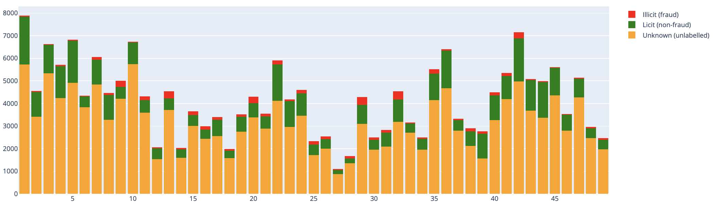
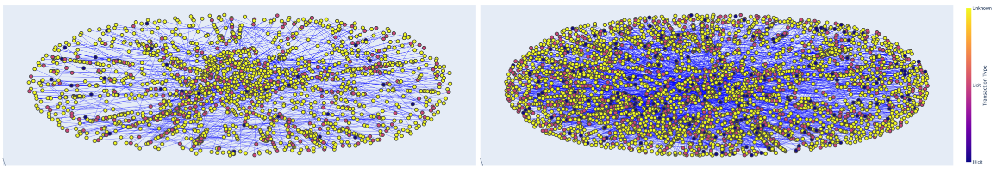
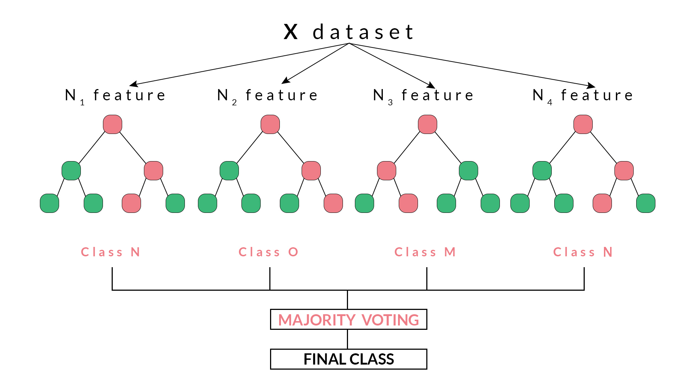
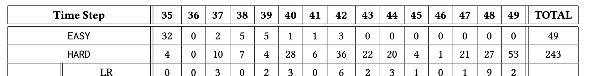
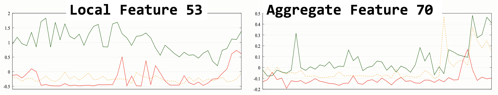

# Elliptic++ Transactions Dataset: A Graph Network of Bitcoin Blockchain Transactions

The Elliptic++ transactions dataset consists of 203k Bitcoin transactions to enable the detection of fraudulent transactions in the Bitcoin network by leveraging graph data.

If you have any questions or create something with this dataset, please let us know by email: [yelmougy3@gatech.edu](mailto:yelmougy3@gatech.edu).

**DATASET CAN BE FOUND HERE: [Google Drive](https://drive.google.com/drive/folders/1MRPXz79Lu_JGLlJ21MDfML44dKN9R08l?usp=sharing)**

## Dataset Summary 

|  |  |
|---|---|
| # Nodes (transactions) | 203,769 |
| # Edges (money flow) | 234,355 |
| # Time steps | 49 |
| # Illicit (class-1) | 4,545 |
| # Licit (class-2) | 42,019 |
| # Unknown (class-3) | 157,205 |
| # Features | 183 |

**DATASET CAN BE FOUND HERE: [Google Drive](https://drive.google.com/drive/folders/1MRPXz79Lu_JGLlJ21MDfML44dKN9R08l?usp=sharing)**

## Dataset Tutorials

We are sharing tutorial notebooks for users and researchers to explore, study, and learn from. The tutorial notebooks cover dataset statistics, graph visualization, model training and classification, case analysis, and feature refinement.

[`Transactions dataset statistics`](Elliptic++_Transactions_Dataset_Statistics.ipynb) : overall transactions data statistics.  
<p align="center">
    <br>
</p>  

[`Transactions graph visualization`](Elliptic++_Transactions_Graph_Visualization.ipynb) : visualizations of the Money Flow Transaction graph (tx-tx graph).  
<p align="center">
    <br>
</p> 

[`Transactions classification`](Elliptic++_Transactions_Classification.ipynb) : model training and classification on the transactions data.  
<p align="center">
    <br>
</p> 

[`Transactions case analysis`](Elliptic++_Transactions_Case_Analysis.ipynb) : unique case (EASY, HARD, AVERAGE) analysis using the transactions data. 
<p align="center">
    <br>
</p> 

[`Transactions feature analysis`](Elliptic++_Transactions_Feature_Analysis.ipynb) : feature importance analysis of the transactions data.
<p align="center">
    <br>
</p> 


## Transactions Dataset Organization

    .
    ├── txs_features.csv                                    # Feature data for all transactions
    ├── txs_classes.csv                                     # Class data for all transactions
    ├── txs_classes.csv                                     # Class data for all transactions
    ├── txs_edgelist.csv                                    # Transaction-Transaction graph edgelist
    ├── Elliptic++ Transactions Dataset Statistics.ipynb    # Tutorial notebook: dataset statistics
    ├── Elliptic++ Transactions Graph Visualization.ipynb   # Tutorial notebook: transaction-transaction graph visualization
    ├── Elliptic++ Transactions Classification.ipynb        # Tutorial notebook: model training and classification
    ├── Elliptic++ Transactions Case Analysis.ipynb         # Tutorial notebook: Unique case (EASY, HARD, AVERAGE) analysis
    ├── Elliptic++ Transactions Feature Analysis.ipynb      # Tutorial notebook: feature importance analysis
    └── README.md

**DATASET CAN BE FOUND HERE: [Google Drive](https://drive.google.com/drive/folders/1MRPXz79Lu_JGLlJ21MDfML44dKN9R08l?usp=sharing)**

# Citation

If you use our dataset in your work, please cite [our paper](https://arxiv.org/pdf/2306.06108.pdf). (Pending publication in ACM SIGKDD '23 conference proceedings)

> Youssef Elmougy and Ling Liu. 2023. Demystifying Fraudulent Transactions and Illicit Nodes in the Bitcoin Network for Financial Forensics. In Proceedings of the 29th ACM SIGKDD Conference on Knowledge Discovery and Data Mining (KDD ’23), August 6–10, 2023, Long Beach, CA, USA. ACM, New York, NY, USA, 16 pages. https://doi.org/10.1145/3580305.3599803

For a longer version of the paper, please refer to our ArXiv paper: [ArXiv version](https://arxiv.org/pdf/2306.06108.pdf)

```
@article{elmougy2023demystifying,
  title={Demystifying Fraudulent Transactions and Illicit Nodes in the Bitcoin Network for Financial Forensics},
  author={Elmougy, Youssef and Liu, Ling},
  journal={arXiv preprint arXiv:2306.06108},
  year={2023}
}
```

# Acknowledgement

Released by: [Youssef Elmougy](https://www.yelmougy.com), [Ling Liu](https://www.cc.gatech.edu/home/lingliu/)

School of Computer Science, Georgia Institute of Technology


If you have any questions or create something with this dataset, please let us know by email: [yelmougy3@gatech.edu](mailto:yelmougy3@gatech.edu).

**DATASET CAN BE FOUND HERE: [Google Drive](https://drive.google.com/drive/folders/1MRPXz79Lu_JGLlJ21MDfML44dKN9R08l?usp=sharing)**
